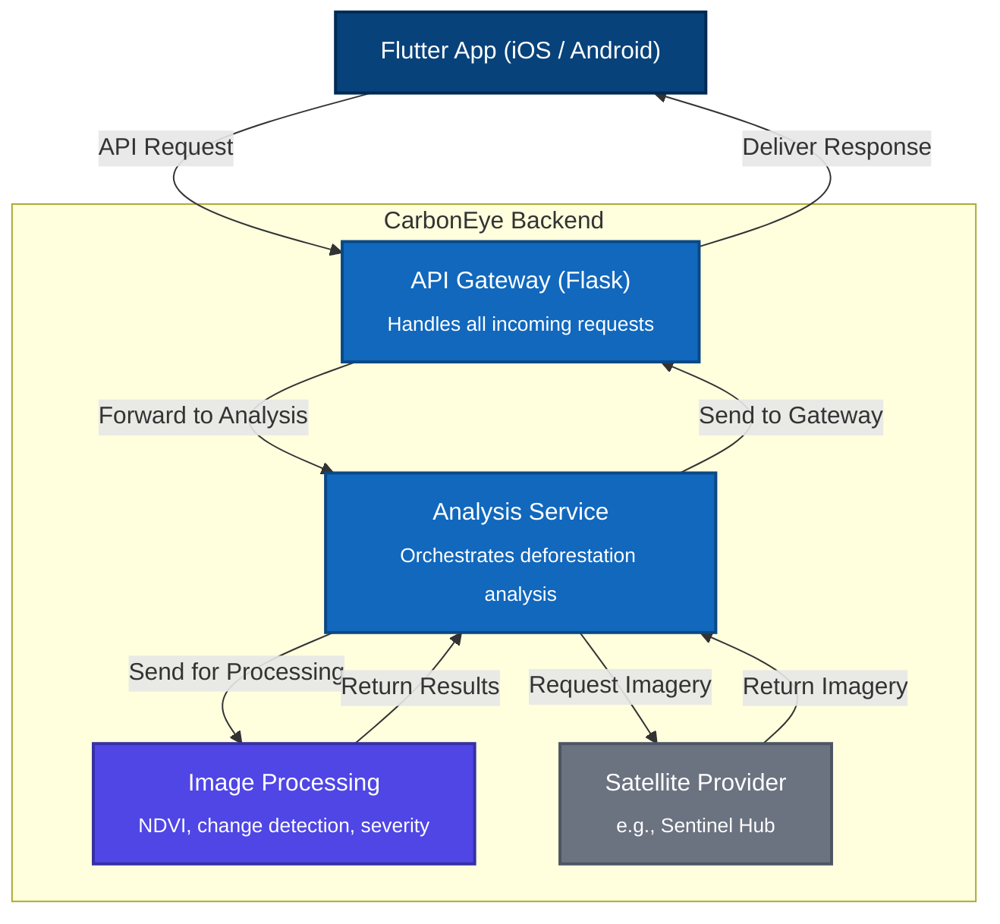

# CarbonEye: Real-Time Deforestation Monitoring Platform

**Eyes on the forest. Always.**

CarbonEye is a powerful tool designed to provide real-time intelligence on deforestation activities across the globe

The platform consists of three main parts:

* **A powerful backend** built with Python and FastAPI, responsible for the heavy lifting of fetching and analyzing satellite data.
* **A cross-platform frontend application** built with Flutter, providing a rich, interactive user experience for analysis on mobile (iOS/Android) and the web.

## Full-Stack Architecture

The CarbonEye platform is built on a modern, decoupled architecture. The clients communicate with the backend via a REST API, allowing for independent development, deployment, and scaling of each component.



## Features

* **Cross-Platform Client:** A Flutter application for Android, iOS, and Web for in-depth analysis.
* **Real-time Analysis:** On-demand deforestation analysis of user-selected regions.
* **Interactive Map Interface:** Users can pan, zoom, and select a bounding box to define an area for analysis.
* **Data Visualization:** Displays true-color and NDVI satellite imagery for "before" and "after" comparison.

## Backend API Endpoints

### `/analyze-deforestation`

* **Method**: `POST`
* **Description**: Analyzes a specified region for deforestation.
* **Request Body**:
    ```json
    {
      "bbox": [ -62.41, -3.66, -62.01, -3.26 ]
    }
    ```
* **Success Response (200 OK)**: Returns a JSON object with true-color images, NDVI maps, alerts, and analysis summary.
* **Error Responses**: Returns `400` for invalid input or `500` for server errors.


